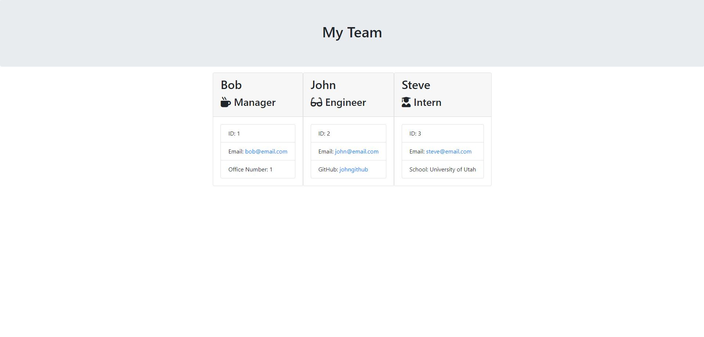

# Team Profile Generator

This is a command-line application that dynamically generates a Team Profile from a user's input. 

[Team Profile Generator](https://drive.google.com/file/d/1nGHiDMc6LsH1qZbPwOeMPSxv4mOBGq0y/view) tutorial video is hosted on Google Drive

This application was authored by [Seth Martineau](https://github.com/slothings)